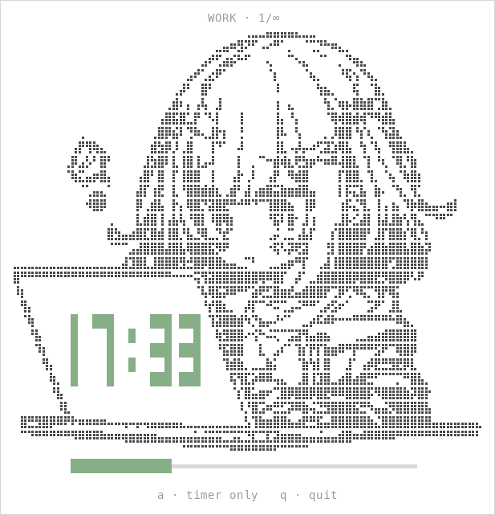

<h1 align="center">pomodoro 🍅</h1>

<p align="center">
  A clean, minimal, animated pomodoro timer for your terminal — with an anime companion.
</p>

<p align="center">
  
  
  
</p>

<p align="center">
  
</p>

## ✨ Features

- **Anime mode** — a chibi girl working at her laptop, drawn entirely in braille art. She blinks `>‿<` every few seconds, and the countdown runs below her in the figlet font *Big Money-nw* (or right on her MacBook lid when the window is short).
- **Timer mode** — just the big countdown, centered. Switch between the two modes live with `a`.
- **Fully responsive** — shrink the window and the display steps down gracefully: anime → big digits → block digits → a single compact line.
- **Manual phase transitions** — your break starts when *you* press enter, not when a timer decides.
- **Notifications** — macOS notification with sound, `notify-send` on Linux, terminal bell as fallback.
- **Zero dependencies** — pure Python standard library, a single file.

## 📦 Install

The recommended way is [pipx](https://pipx.pypa.io/), which installs the `pomodoro` command globally in its own isolated environment.

### macOS

```sh
brew install pipx
pipx ensurepath
pipx install git+https://github.com/antallpt/pomodoro.git
```

### Linux

```sh
sudo apt install pipx        # Debian/Ubuntu — use dnf/pacman on other distros
pipx ensurepath
pipx install git+https://github.com/antallpt/pomodoro.git
```

For desktop notifications, make sure `notify-send` is available (package `libnotify-bin` on Debian/Ubuntu — usually preinstalled).

### Windows

The timer uses Unix terminal APIs, so on Windows it runs inside [WSL](https://learn.microsoft.com/windows/wsl/install):

```powershell
wsl --install        # once, then open a WSL terminal
```

Inside WSL, follow the Linux steps above. Windows Terminal renders the braille art and colors nicely.

Open a new shell afterwards and `pomodoro` is available everywhere. Alternative from a local clone: `pipx install .` (or `pip install .` into an environment of your choice).

## 🚀 Usage

```sh
pomodoro -s                    # 25 min work · 5 min pause · endless loops
pomodoro -s -d 15 -p 5 -l 4    # 15 min work · 5 min pause · 4 loops
```

| Flag | Meaning | Default |
| --- | --- | --- |
| `-s`, `--start` | start the timer | – |
| `-d`, `--duration` | work duration in minutes | 25 |
| `-p`, `--pause` | pause duration in minutes | 5 |
| `-l`, `--loops` | number of loops, `0` = infinite | 0 |

When a phase ends you get a notification, and the timer waits for you: press enter to start the break (or the next pomodoro).

## ⌨️ Keys

| Key | Action |
| --- | --- |
| `enter` | start the next phase |
| `a` | switch between anime mode and timer-only mode |
| `q` / `ctrl+c` | quit |

Anime mode needs roughly 70×48 characters of space for the big digits (70×40 for the laptop-lid clock); below that the timer falls back to the plain layouts automatically.

## 🖥️ Requirements

macOS or Linux (Windows via WSL) · Python ≥ 3.9

## 📄 License

[MIT](LICENSE)
